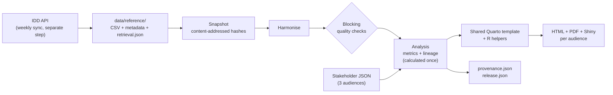

# Reproducible infectious-disease reports

One open Swiss data source, three audiences, one command. This project turns the Federal Office of Public Health (FOPH) [Infectious Diseases Dashboard](https://www.idd.bag.admin.ch/) exports into interactive HTML reports for researchers, health institutions and the public. All three come from a single shared Quarto template and differ only by audience parameter files. Every report carries machine-readable provenance, and uncertainty and limitations are shown to every audience, translated rather than hidden.

Built for the hackathon challenge *One Data Source, Many Audiences: reproducible, parameterised communication of life-science data*.

## Quick start

Prerequisites (versions pinned in `workflow/toolchain.json`): Python 3.11.6, R 4.3.2, Quarto 1.3.353, and TinyTeX v2026.10 for PDFs. Install steps: [reproduction guide](docs/reproduction.md#setup-and-run).

```sh
python3 -m venv .venv && source .venv/bin/activate
pip install -r scripts/health_pipeline/requirements.lock.txt
Rscript workflow/restore_r.R

snakemake --cores 2          # or: bash scripts/health_pipeline/run_all.sh
```

Open `results/reports/public/report.html` in a browser. Keep each `results/reports/<id>/` folder together so links and downloads work. No network access is needed: the committed data in `data/reference/` is read directly.

## What you get

| Audience | Report | Style |
|---|---|---|
| Researchers (`researcher`) | `results/reports/researcher/report.html` | Technical: parameters and filters, coverage, quality checks, methods, reproduction code |
| Health institutions (`health_institution`) | `results/reports/health_institution/report.html` | Monitoring: largest changes in case counts, small-number flags, quality summary |
| Public (`public`) | `results/reports/public/report.html` | Plain language: "How sure can we be?", readable provenance |

Each folder also holds `methods.html`, PDFs, `provenance.json` (also embedded in each HTML page), the analysis tables in `data/`, and a Shiny app. `results/release.json` records artifact hashes, code hashes, Git state and runtime versions. Details: [audiences, outputs and provenance](docs/audiences.md).

To add an audience, copy a file in `scripts/health_pipeline/config/stakeholders/`, change its `id`, wording, sections and presentation, and list the id in `workflow/config.yaml`. The template does not change.

## How it works



Statistics are calculated once in Python; every format and audience only presents the verified tables. Full description: [architecture](docs/architecture.md).

## Data source and version

FOPH Infectious Diseases Dashboard exports from the public API (`https://api.idd.bag.admin.ch/api/v1/export/latest/<DATASET>/csv`), committed under `data/reference/` with a `retrieval.json` per dataset (source URL, retrieval time, SHA-256). The publisher updates weekly on Wednesdays. Each report's provenance names the snapshot id, publisher release dates and retrieval dates it used. The FOPH states the data are publicly accessible and may be used with proper source attribution; please attribute **Federal Office of Public Health (FOPH/BAG), Infectious Diseases Dashboard**. See [data/README.md](data/README.md).

## Read this before using the numbers

The reports describe officially notified cases, not all infections. They are descriptive comparisons with a reference year, not tests of significance or causal claims. National totals only (Switzerland plus Liechtenstein); no canton-level or weekly seasonal alert analysis. The viral increase versus 2019 (+124%) turns into −3% when influenza is excluded. Full list: [limitations](docs/limitations.md).

## Documentation

| Topic | Document |
|---|---|
| Architecture and design decisions | [docs/architecture.md](docs/architecture.md) |
| Audiences, outputs, provenance format | [docs/audiences.md](docs/audiences.md) |
| Setup, full reproduction, archived releases | [docs/reproduction.md](docs/reproduction.md) |
| Scientific policy and data contract | [docs/scientific-policy.md](docs/scientific-policy.md), [SCHEMA.md](scripts/health_pipeline/SCHEMA.md) |
| Limitations | [docs/limitations.md](docs/limitations.md) |
| Demo walkthrough | [docs/demo.md](docs/demo.md) |
| Release notes and checklist | [RELEASE_NOTES.md](RELEASE_NOTES.md), [docs/release-checklist.md](docs/release-checklist.md) |
| Repository map, phase records | [docs/repository-map.md](docs/repository-map.md), `docs/phase-*.md` |
| Contributing | [CONTRIBUTING.md](CONTRIBUTING.md), [GETTING_STARTED.md](GETTING_STARTED.md) |
| Optional Marimo interface | [CONNECTOR_SETUP.md](CONNECTOR_SETUP.md) |

Citing this work: see [CITATION.cff](CITATION.cff).

## Tests and release discipline

```sh
ruff check .
python -m pytest -q
snakemake --dry-run --cores 1
# after a full build
python scripts/health_pipeline/check_outputs.py
python scripts/health_pipeline/verify_release.py --out results
Rscript tests/shiny_smoke.R results/reports/researcher/app
```

Tests cover subgroup safety, incomplete months/years/baselines, denominators, source completeness, metadata conflicts, overlapping exports, nonzero CLI failures, stale gates, snapshot relocation/tampering, deterministic tables, and independent reconstruction of every fixture metric from raw records and formula inputs. The final dry run should say no work is needed after a successful unchanged build.

CI is split into gated jobs (`docs/phase-6-ci-hardening.md`): `fast` (Ruff, tests, dry run), `secrets` (pinned gitleaks history scan), `container` (Docker build and smoke run) and `full` (all three audiences, output and provenance checks, release-hash and rendered-link verification, Shiny checks, no-op rebuild). It uploads a release bundle only after every `full` step succeeds. It does not deploy or overwrite a production site. A failed local build may leave older reports on disk; treat only a successfully completed build and its matching `release.json` as a release. Preserve previously uploaded successful artifacts independently of a new build.

The production Python lock at `scripts/health_pipeline/requirements.lock.txt` pins the Snakemake/report pipeline; `uv.lock` pins the optional Marimo/connector environment from `pyproject.toml`; `renv.lock` records R dependencies. `workflow/toolchain.json` is the machine-readable source of runtime version policy. `workflow/environment.yml` is an alternative convenience environment, not an additional authoritative lock.

See [GETTING_STARTED.md](GETTING_STARTED.md) for setup and reproduction instructions.
