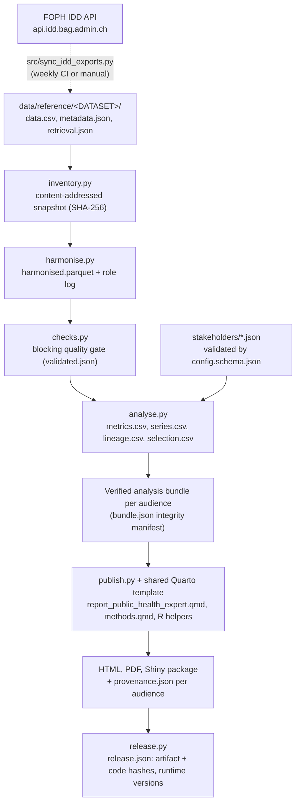

# Architecture

## Data flow

Snakemake (`Snakefile`) orchestrates the stages. It expands the analysis and rendering rules once per stakeholder listed in `workflow/config.yaml`; the shared stages run once.

## Design decisions

| Decision | Reason |
|---|---|
| Calculate once, present many times | Python writes the metrics and lineage; HTML, PDF and Shiny only read verified tables, so formats and audiences cannot disagree. |
| One template, parameterised audiences | An audience is a JSON file (`title`, `question`, `outputs`, `presentation`). Adding one needs no template change. |
| Identical analytic parameters across audiences | Geography, years, reference year, exclusions and source priority are the same, so the numbers match. A test enforces that only communication fields differ. |
| Blocking quality gate | A critical check failure stops the build; analysis verifies a content-bound success marker, so stale validation cannot be reused. |
| Content-addressed snapshots | The snapshot id is a hash of every input file. An archived snapshot reproduces a release without the live data tree or network. |
| Provenance as data | `provenance.json` is both written beside and embedded in each HTML page, with source, dates, filters, effective parameters, versions, Git commit and render time. |
| Network separated from building | Builds read only `data/reference/`. Acquisition is a separate, committed, reviewable step. |
| Pinned toolchain | `workflow/toolchain.json` is the version contract; tests check Docker, Conda, CI and `pyproject.toml` against it. |

## Components

| Path | Role |
|---|---|
| `Snakefile`, `workflow/` | Orchestration, default configuration, stakeholder schema, toolchain contract, R restore |
| `scripts/health_pipeline/*.py` | Pipeline stages and `check_outputs.py` (post-build verification) |
| `scripts/health_pipeline/config/stakeholders/` | One JSON per audience (plus the retained `public_health_expert.json` base profile) |
| `scripts/health_pipeline/report_public_health_expert.qmd`, `templates/` | The shared report source, methods report, R presentation helpers, styles, Shiny app |
| `data/reference/` | Canonical committed source data and per-dataset retrieval records |
| `src/` | Optional connector utilities and Marimo interface (see `CONNECTOR_SETUP.md`) |
| `tests/` | Python tests (calculations, gates, audiences, environment) and R smoke tests |

## Known structural limits

The pipeline modules still live in `scripts/health_pipeline/` and are imported through a path insertion rather than an installed package; the packaging refactor was deliberately left out of this release. The template file keeps its historical name `report_public_health_expert.qmd` although it is generic. See [limitations](limitations.md).
